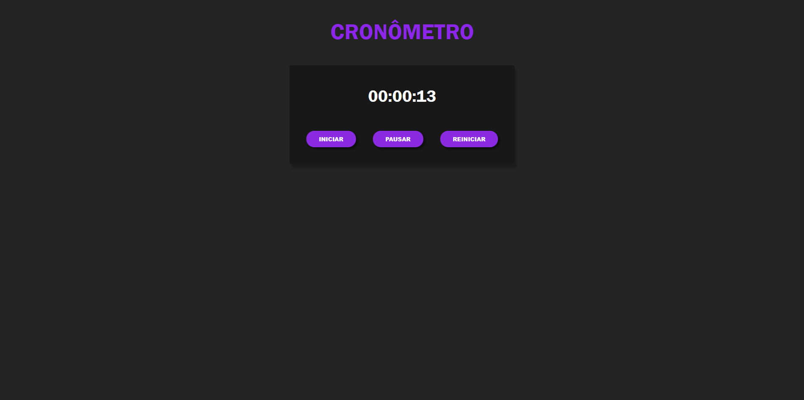

# Cronometro

O usuário tem 3 opções

✔ Iniciar cronômetro

✔ Pausar cronômetro

✔ Reiniciar cronômetro

#### TECNOLOGIAS USADAS

✔ HTML5

✔ CSS3

✔ JAVASCRIPT

#### O que aprendi

Terminando esse projeto, aprendi a manipular o tempo em Javascript, além de ter aprendido um pouco mais sobre posicionamento de elementos no CSS.

